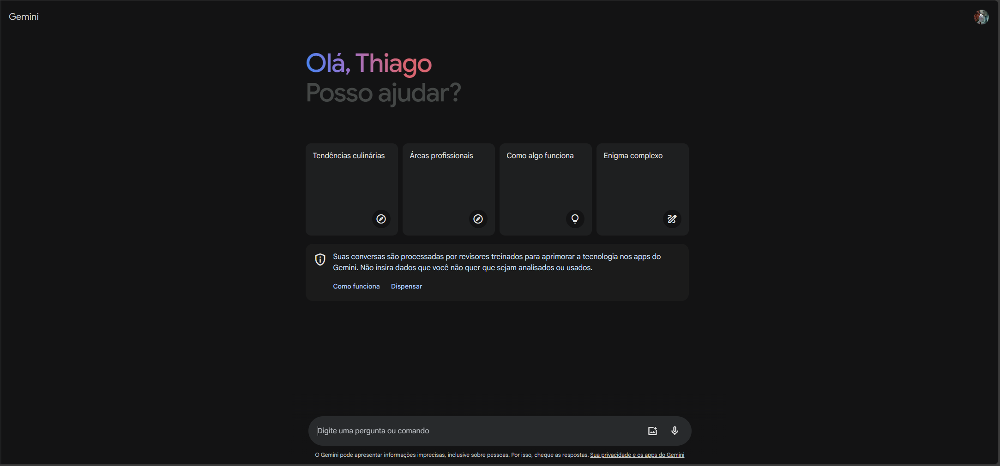
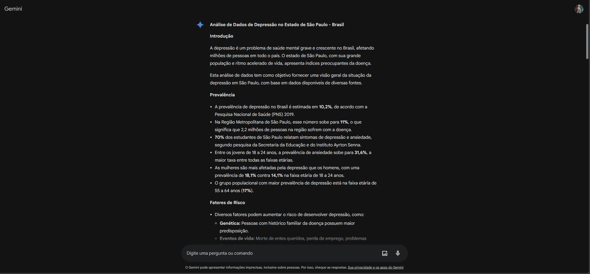
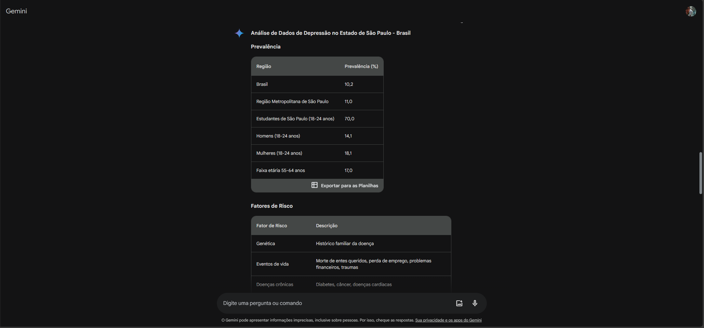

# Gemini, IA do Google

> [!NOTE]
> Aula 01

Acessando o Google Gemini

Desafio 01

No prompt, realizei o seguinte questionamento:

`Crie uma análise de dados com base em dados de depressão no estado de São Paulo - Brasil`

Desafio 02

No prompt, realizei o segundo questionamento com base no primeiro:

`Gere uma planilha com esses dados`
